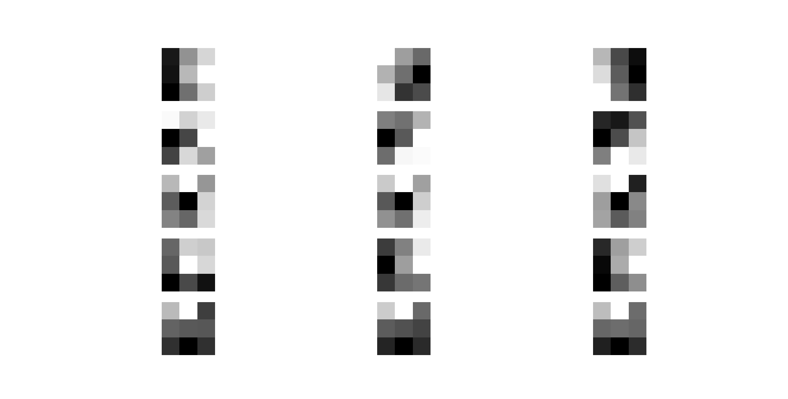
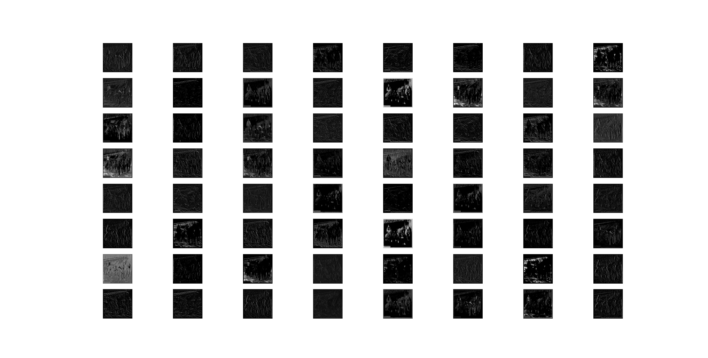
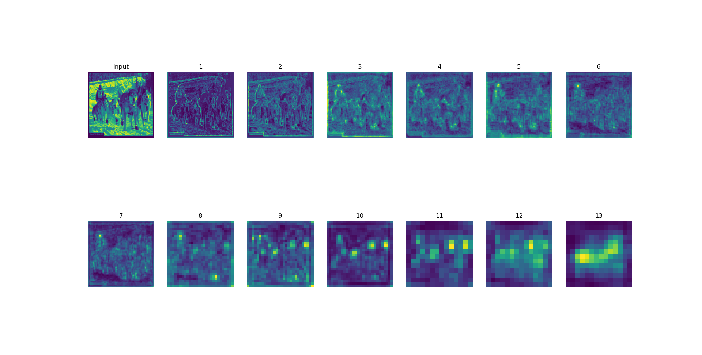

# VGG16 Visualizations with PyTorch


Image source: [ResearchGate](https://www.researchgate.net/figure/A-sample-architecture-of-VGG-16-Image-source-42_fig3_343092954)


This repository contains Python scripts to visualize filters and feature maps from different layers of the VGG16 model using PyTorch. The VGG16 model is a widely used convolutional neural network architecture for image classification.

### Visualization Examples

#### 1. Filter Visualization


The script [`visualize_filters.py`](visualize_filters.py) visualizes the filters learned by a chosen convolutional layer in the VGG16 model.

#### 2. Feature Map Visualization


The script [`visualize_feature_maps_each_layer.py`](visualize_feature_maps_each_layer.py) generates feature maps for each layer of the VGG16 model using a sample image.

#### 3. Feature Maps from Different Layers


The script [`visualize_feature_maps_different_layers.py`](visualize_feature_maps_different_layers.py) demonstrates feature maps from selected layers of the VGG16 model using a sample image.

### Usage
- Clone the repository:
  ```bash
  git clone https://github.com/karthik2501/VGG16-Visualizations.git
  cd VGG16-Visualizations
  
- Run the scripts using Python:
  ```bash
  python visualize_filters.py
  python visualize_feature_maps_each_layer.py
  python visualize_feature_maps_different_layers.py

### Requirements
- Python 3.x
- PyTorch
- torchvision
- Matplotlib

### Acknowledgments
- The VGG16 model architecture is credited to the authors of the paper ["Very Deep Convolutional Networks for Large-Scale Image Recognition"](https://arxiv.org/abs/1409.1556).

Feel free to explore and modify the scripts for different layers and images!

  
